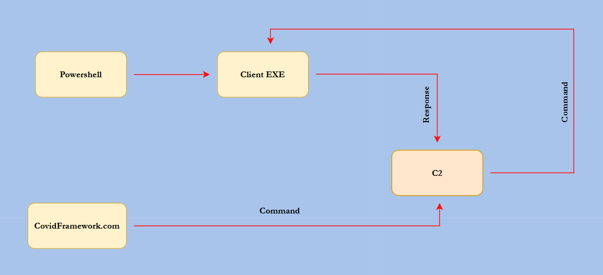

# The Covid Framework

This project's main goal is to create an exploitation framework and all in one website to maintain an attack.
It provides built in functions in order to execute remote code on a target machine. 
The best thing about it, is the visulization of things such as a live location and easy response reading from commands.

Enjoy!

## Available features

Wifi passwords

Chrome passwords

Persistence

Privilege escalation

Change background image

Take screenshot 

Upload/Download files

Interactive powershell

Live persist location

## Diagram

